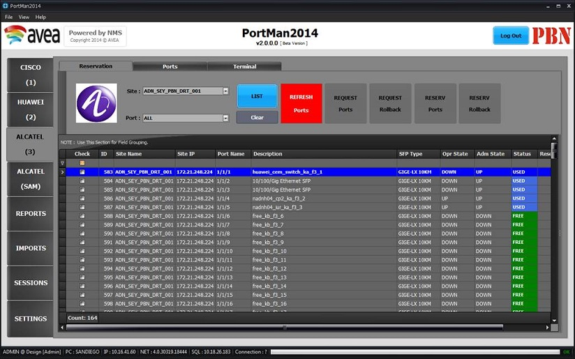
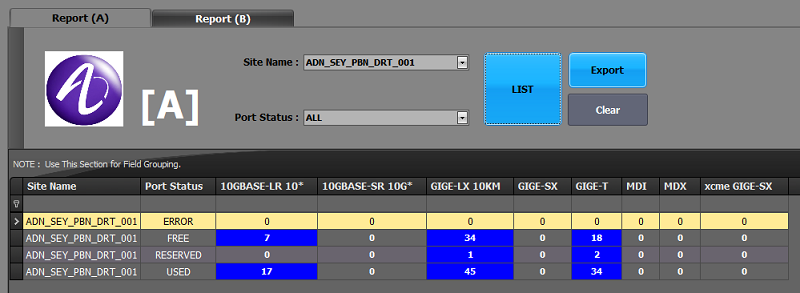
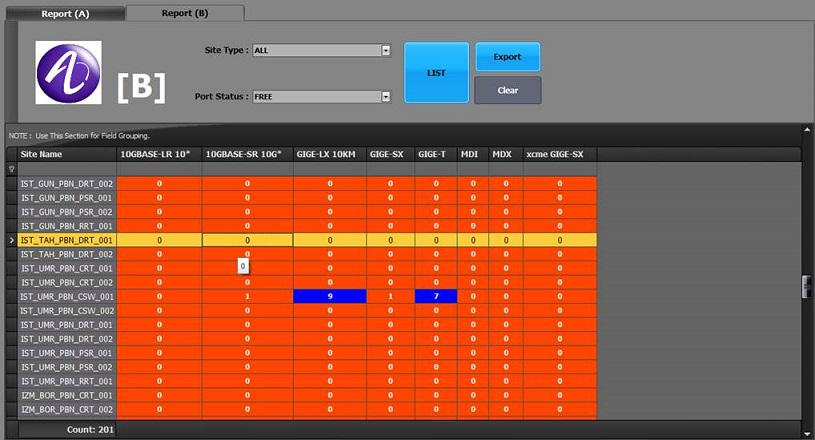
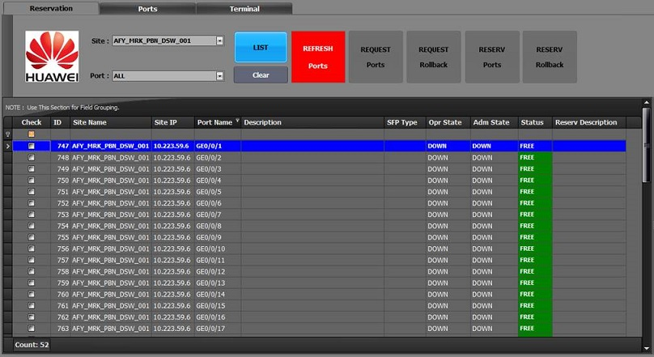
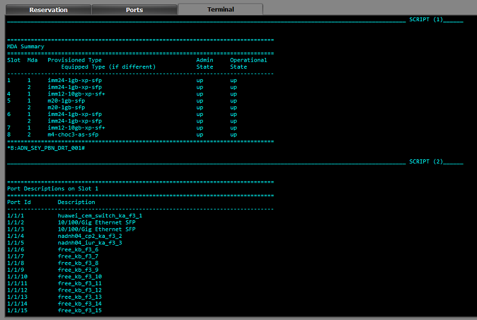
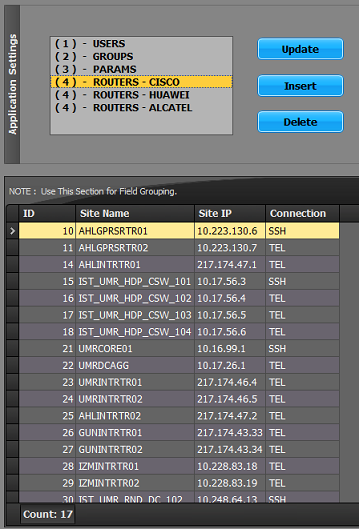

# PortMan2014

Analysis and Development Document

| **Written by** | Hasan YILDIRIM ( SAP/NET Consultant) \@ **PIA** |
|----------------|-------------------------------------------------|
| **Email**      | HasanYildirim\@hotmail.com                      |
| **Place**      | TeknoPark / Kurtkoy / İSTANBUL                  |
| **Date**       | 27.March.2015                                   |
| **Version**    | v1.0                                            |

**[1] Purpose of This Software :**

Managing different vendor equipment, checking their port status and
administration of all devices have been always a challenge in a wide range
networks. PortMan2014 was developed for this purpose. It is tailor made, custom
tool for the infrastructure people. The final version of PortMan2014 is
supporting **CISCO / HUAWEI / ALCATEL** modules. It also includes important
notification reports for Alcatel Infrastructure.

## Function List for Vendors

**HUAWEI – List :**

1) system-view

2) user-interface current

3) screen-length 0

4) screen-width 200

5) display inter description

**HUAWEI – Reserve :**

1) system-view

2) interface GigabitEthernet {0}

3) description {0}

**HUAWEI – Rollback :**

1) system-view

2) interface GigabitEthernet {0}

3) undo description {0}

**CISCO – List :**

1) terminal width 0

2) terminal length 0

3) show interfaces description

**CISCO – Reserve :**

1) config terminal

2) interface GigabitEthernet {0}

3) description {0}

**CISCO – Rollback :**

1) config terminal

2) interface GigabitEthernet {0}

3) no description {0}

**ALCATEL – List :**

1) environment no more

2) show port description  (it gives only port number and description)

3) show port (it gives port number and status, sfp information)

**ALCATEL – Reserve :**

1) configure port {0} description

**ALCATEL – Rollback :**

1) configure port {0} no description

---------------------------------------------------------------